# Тестування працездатності системи

Для тестування системи використано VS Code Thunder Client

## Підключення до серверу

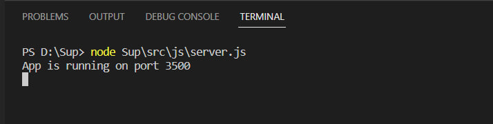

## GET запит:
### Усіх команд

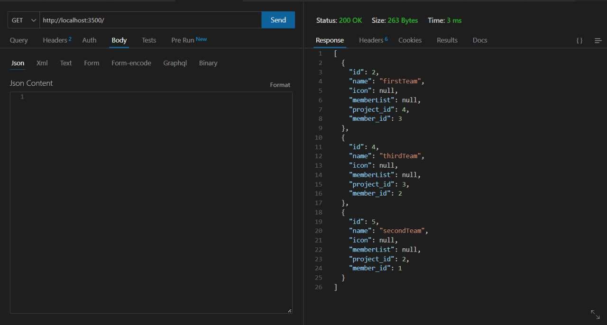

### Команди по id

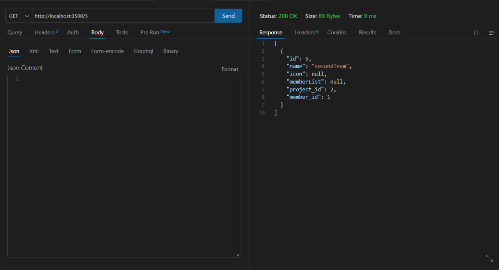

### Команди по неіснуючому id

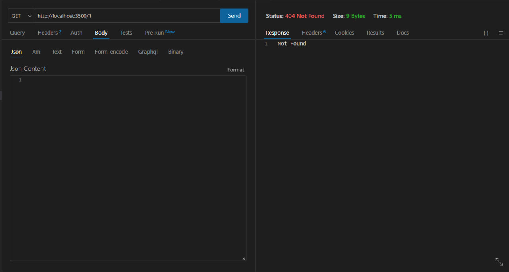

## POST запит:
### Додавання існуючої команди

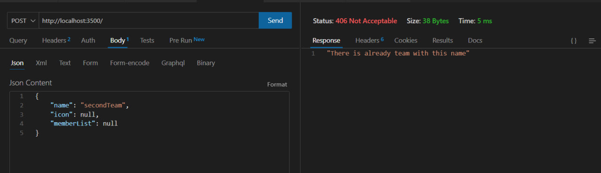

### Додавання команди без інформації

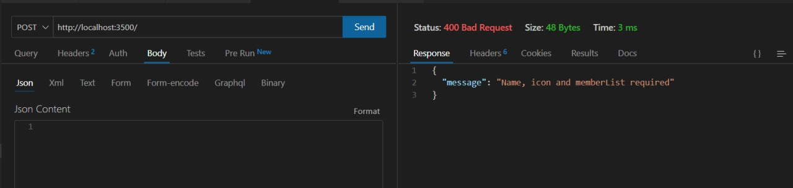

### Приклади додавання команд

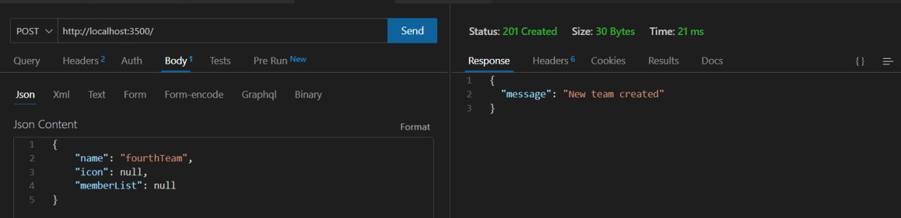

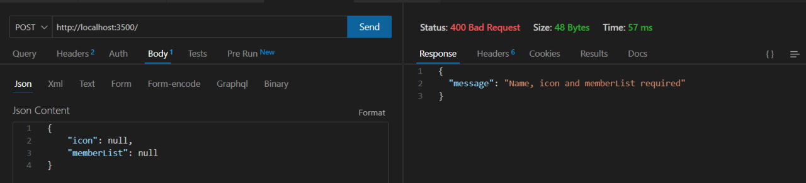

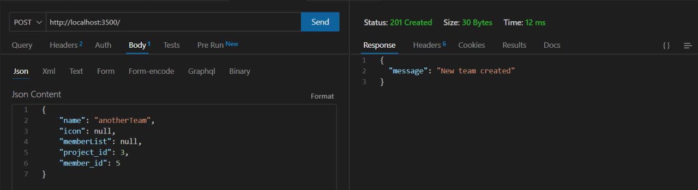

### Результат

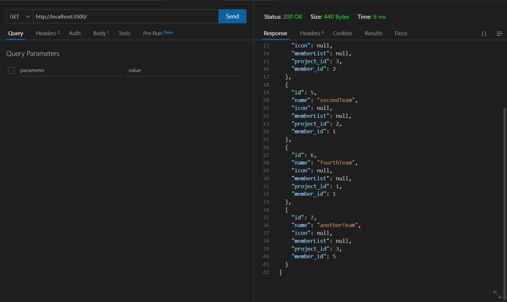

## PUT запит:
### Зміна імені команди

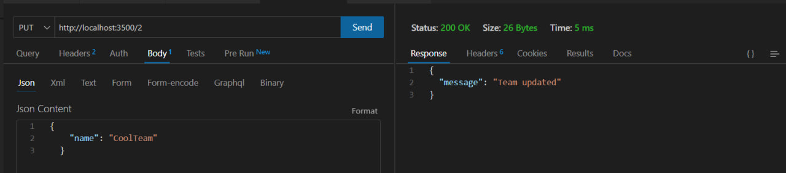

### Результат

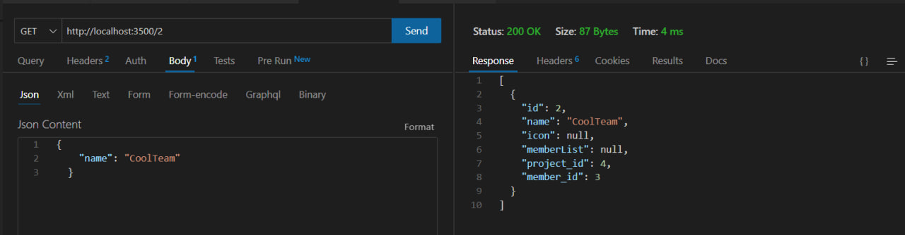

### Зміна назви списку членів

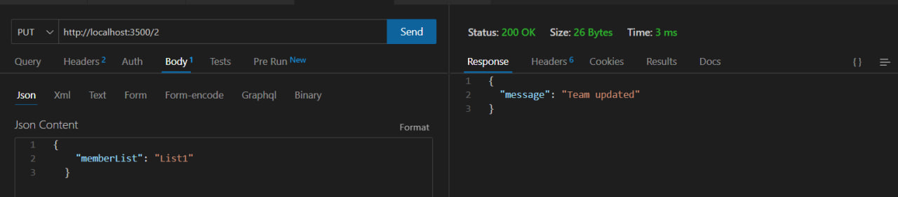

### Результат

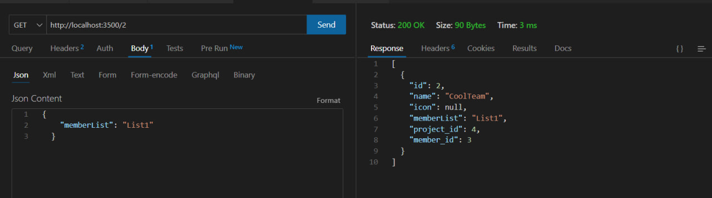

### Зміна id

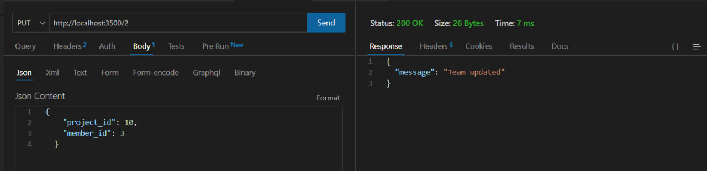

### Результат

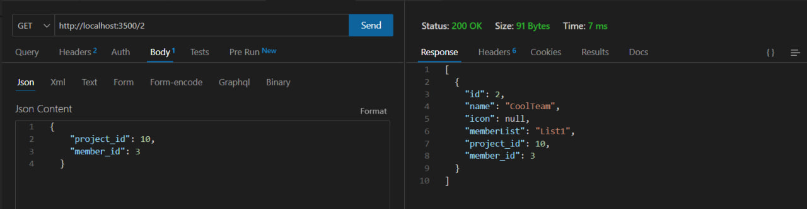

### Запит зміни без id

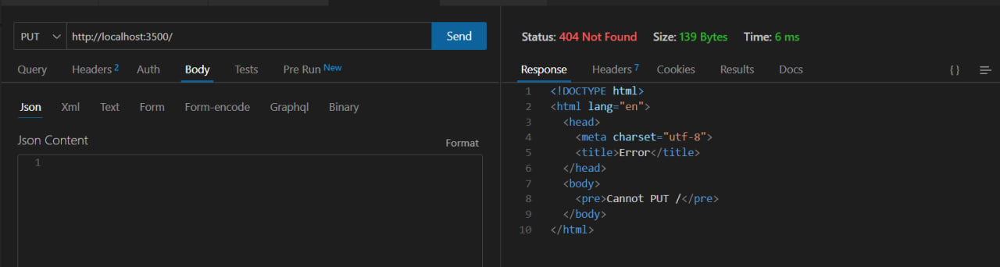

### Запит зміни за неіснуючим id

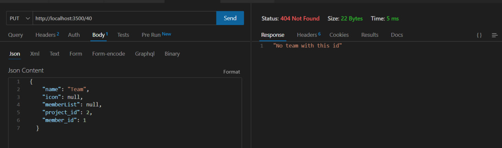

### Запит зміни без інформації

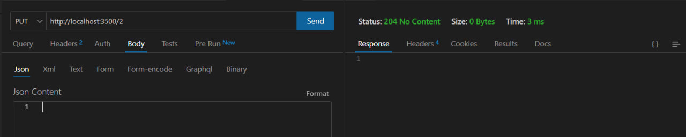

## DELETE запит:
### Видалення за існуючим id 

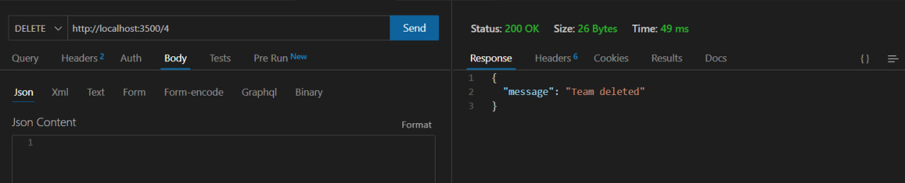

### Результат

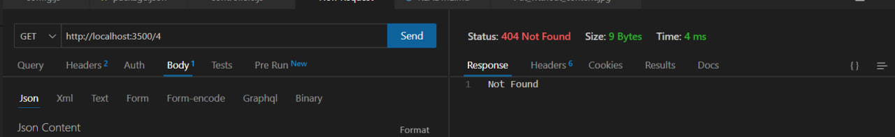

## Видалення за неіснуючим id

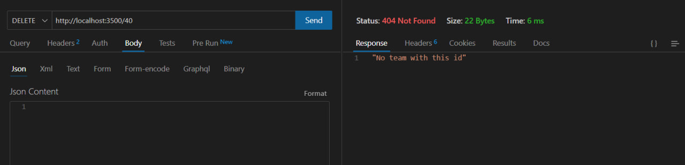

